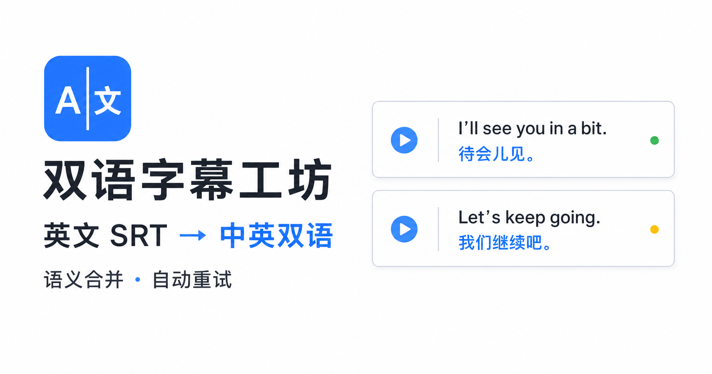

# 双语字幕工坊 · Bilingual Subtitle Studio



一个面向 Buzz 英文识别字幕的中英双语 SRT 整理工具。它会先重新合并被
Buzz 拆散的短片段，再按照完整语义和自然标点断句，最后调用 DeepSeek API
生成逐条对齐的中文字幕。

## 立即使用

**[打开在线工具](https://bilingual-subtitle-studio.guanzun9-tools.workers.dev)**

无需安装、无需注册、无需 ChatGPT 登录。准备两样东西即可：

1. Buzz 导出的英文 `.srt` 文件
2. 自己的 [DeepSeek API Key](https://platform.deepseek.com/api_keys)

上传字幕、点击翻译、下载双语 SRT，整个过程都在一个页面完成。字幕文件和
API Key 不会被本站保存。

## 为什么做这个工具

Buzz 导出的英文 SRT 经常按照识别时间切成很短的片段。直接逐条翻译容易出现：

- 一个完整英文句子被拆成多条，中文和英文含义错位
- 短片段缺少上下文，AI 把下一条内容提前翻译
- 单条字幕过长，画面上阅读体验不佳
- 网络或模型响应异常后，整批翻译需要重新开始

双语字幕工坊会先恢复完整句子的上下文，再生成适合观看的字幕条目，并在翻译
中断时保留已经完成的进度。

## 主要功能

- 解析标准 SRT，兼容 UTF-8 BOM 与 Windows 换行
- 自动合并 Buzz 拆散的相邻短时间块
- 优先在句号、问号、逗号和分号等自然位置断句
- 可调节每条英文字幕的建议长度
- 可选择拆成新时间条目，或仅在原字幕内换行
- 拆分后按文字比例分配时间，保持原始首尾时间范围
- 通过完整句子上下文提高翻译准确度，同时保持逐条严格对应
- 分批调用 DeepSeek，网络或返回格式异常时自动重试
- 实时显示制作百分比与“已完成/总条数”
- 失败后保留已完成译文，可选择继续任务或从头重新开始
- 预览区显示全部字幕，不再只展示前 12 条
- 支持中文在上或英文在上的双语顺序
- 支持逐条校对译文并导出带 UTF-8 BOM 的 SRT

## 当前版本

`v0.2.0`：新增持续制作进度、失败任务恢复与重新开始、全部字幕预览。
完整记录见 [CHANGELOG.md](./CHANGELOG.md)。

## 使用流程

1. 从 Buzz 导出英文 `.srt` 文件。
2. 将文件拖入工具，调整字幕建议长度和断句方式。
3. 填写自己的 DeepSeek API Key，选择翻译模型和双语顺序。
4. 开始翻译；如遇网络中断，可继续处理尚未完成的条目。
5. 在预览区校对译文，下载中英双语 SRT。

## 隐私说明

- API Key 只随当次翻译请求发送，不写入本地文件或浏览器存储
- 字幕文件只在当前页面中处理，不保存到项目服务器
- 翻译内容会按照 DeepSeek API 的处理流程发送给 DeepSeek

<details>
<summary>开发者信息（普通用户无需阅读）</summary>

### 本地运行

需要 Node.js `>=22.13.0`。

```bash
git clone https://github.com/guanzun9-oss/bilingual-subtitle-studio.git
cd bilingual-subtitle-studio
npm install
npm run dev
```

浏览器打开 `http://localhost:3000`。

### 测试与构建

```bash
npm test
npm run build
```

技术栈：React 19、Next.js 16 / vinext、TypeScript、Cloudflare Workers 和
DeepSeek Chat Completions API。

</details>

## 参与改进

欢迎通过 [Issues](https://github.com/guanzun9-oss/bilingual-subtitle-studio/issues)
反馈断句样例、翻译异常或界面建议。提交问题时请删除字幕中的私人信息，并且不要
粘贴 API Key。
