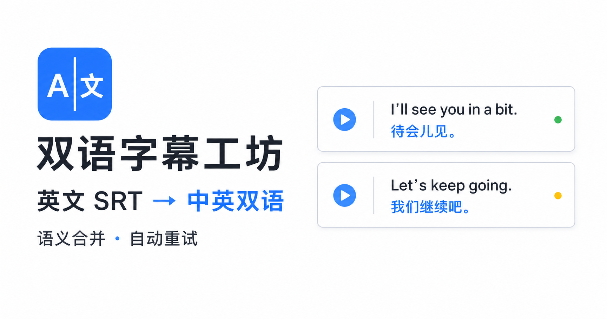

# Cuewise 字幕匠




一个面向 Buzz 英文识别字幕的中英双语 SRT 整理工具。它以 Buzz 导出的原始
字幕条目为边界，只拆分、不合并：句末标点后另起一条，超长句再按自然停顿
拆分，最后调用 DeepSeek API 生成逐条对齐的中文字幕。

## 立即使用

**[打开在线工具](https://bilingual-subtitle-studio.guanzun9-tools.workers.dev)**

无需安装、无需注册、无需 ChatGPT 登录。准备两样东西即可：

1. Buzz 导出的英文 `.srt` 文件
2. 自己的 [DeepSeek API Key](https://platform.deepseek.com/api_keys)

上传字幕、点击翻译、下载双语 SRT，整个过程都在一个页面完成。字幕文件和
API Key 不会上传保存到本站服务器；翻译进度只保存在你自己的浏览器里。

## 为什么做这个工具

Buzz 导出的英文 SRT 经常按照识别时间切成很短的片段。直接逐条翻译容易出现：

- 一个完整英文句子被拆成多条，中文和英文含义错位
- 短片段缺少上下文，AI 把下一条内容提前翻译
- 单条字幕过长，画面上阅读体验不佳
- 网络或模型响应异常后，整批翻译需要重新开始

Cuewise 在每个原字幕条目内整理断句，用原条目文本作为翻译上下文，保持
中英文逐条对应，并在翻译中断时保留已经完成的进度。

## 主要功能

- 解析标准 SRT，兼容 UTF-8 BOM 与 Windows 换行
- 严格保留 Buzz 原始条目边界，不合并相邻条目，整理后条数不会减少
- 无论长短，句号、问号、感叹号结束一句后都另起字幕条目；省略号按续句情况判断
- 连续句末标点及紧随的闭引号、闭括号留在前一句，避免单独成为条目
- 避免把小数点、常见英文称谓缩写和姓名首字母当成句末
- 先按句末拆分，超长句再优先在逗号、分号和自然语法边界拆分
- 短句保持单行，超过行宽才换行；默认横屏英文每行约 42 个字符
- 中文限制为每行 16 个字符、每条最多两行，并按显示时长精炼译文
- 可调节每条英文字幕的建议长度
- 可选择超长句拆成新条目，或仅在同一句内换行；两种模式都强制句末另起一条
- 每个拆分条目的时间均在所属原条目内，保留原条目的起止时间和条目间停顿
- 使用所属原条目文本作为翻译上下文，同时保持逐条严格对应；每批开头补充前一条原字幕，帮助理解跨条目的句子（不提供后一条，避免提前翻译）
- 可填写「人名与术语」表（如 `Zane = 赞恩`），整部字幕统一译名；只把本批出现的词条发给模型
- 分批调用 DeepSeek，同时进行 3 批；网络或返回格式异常时自动重试，单批失败不影响其他批次
- 同一原条目的上下文只发送一次，并用短 ID/紧凑 JSON 降低 token 消耗
- 实时显示制作百分比与“已完成/总条数”；字幕轨道图按时间展示每条的翻译与检查状态，点击即可定位
- 可筛选未翻译或需检查的条目，用 ⌘/Ctrl + ↑↓ 逐条校对
- 首页展示处理前后对比、使用方法和常见问题，不填 Key 也能先看演示；浅色界面，跟随系统切换深色；手机上翻译按钮固定在底部
- 失败后保留已完成译文，可选择继续任务或从头重新开始
- 进度自动保存在本机浏览器：刷新、关闭页面或浏览器崩溃后，可从「上次的任务」继续，重新选择同一文件也会自动恢复译文和手动修改
- 预览区显示全部字幕，不再只展示前 12 条
- 支持中文在上或英文在上的双语顺序
- 支持逐条校对译文并导出带 UTF-8 BOM 的 SRT
- 可选择达芬奇、Premiere Pro 和通用 SRT，提供各平台官方导入与样式设置说明
- 横屏与竖屏排版预设，同时作用于英文整理、中文导出和效果预览
- 逐条模拟最终双语排版，并提示过短时长、过快阅读速度和行宽问题
- 可手动设置导出时间整体偏移，以匹配视频在剪辑时间线中的位置

断句依据、平台资料及适配边界见 [字幕规则与来源](./docs/subtitle-rules.md)。

## 当前版本

当前版本 `v0.6.0`：更名为 Cuewise 字幕匠，全新产品网站与工作台；新增字幕轨道图、条目筛选与快捷键，演示无需 API Key。
完整记录见 [CHANGELOG.md](./CHANGELOG.md)。

## 质量与限制

- 每个原条目独立处理，即使一句话跨越多个条目也不会合并。在同一个原始条目
  内部切分时，按文本位置估算切点，保留首尾时间；该估算不等同于逐词音频对齐。
- 工具无法从单独的 SRT 获得音频波形和画面转场信息。要求逐帧精修的影视项目，
  导出后仍应结合原视频进行最终通看。
- 服务端会校验模型返回的 ID 与非空译文，不完整条目会单独重试。中文长度和
  阅读速度作为质量提示，偏长译文不会被丢弃或阻止导出。

## 使用流程

1. 从 Buzz 导出英文 `.srt` 文件。
2. 将文件拖入工具，选择目标剪辑平台和视频画幅，调整字幕建议长度和断句方式。
3. 填写自己的 DeepSeek API Key，选择翻译模型和双语顺序。
4. 开始翻译；如遇网络中断，可继续处理尚未完成的条目。
5. 在预览区校对译文，下载中英双语 SRT。

## 隐私说明

- API Key 只随翻译请求发送给 DeepSeek，默认不保存；勾选「在本机浏览器记住 Key」后才写入本机浏览器存储，取消勾选即删除
- 字幕原文、译文进度和设置只保存在本机浏览器（最近 3 个任务），不保存到项目服务器；可在「上次的任务」中删除
- 翻译内容会按照 DeepSeek API 的处理流程发送给 DeepSeek

<details>
<summary>开发者信息（普通用户无需阅读）</summary>

### 本地运行

需要 Node.js `>=22.13.0`。

```bash
git clone https://github.com/guanzun9-oss/bilingual-subtitle-studio.git
cd bilingual-subtitle-studio
npm ci
npm run setup:git
npm run dev
```

浏览器打开 `http://localhost:3000`。

### 测试与构建

```bash
npm run check
```

技术栈：React 19、Next.js 16 / vinext、TypeScript、Cloudflare Workers 和
DeepSeek Chat Completions API。

开发分支、提交检查、PR 和依赖更新约定见 [CONTRIBUTING.md](./CONTRIBUTING.md)，
版本发布与回滚见 [发布流程](./docs/releasing.md)。

</details>

## 参与改进

欢迎通过 [Issues](https://github.com/guanzun9-oss/bilingual-subtitle-studio/issues)
反馈断句样例、翻译异常或界面建议。提交问题时请删除字幕中的私人信息，并且不要
粘贴 API Key。
